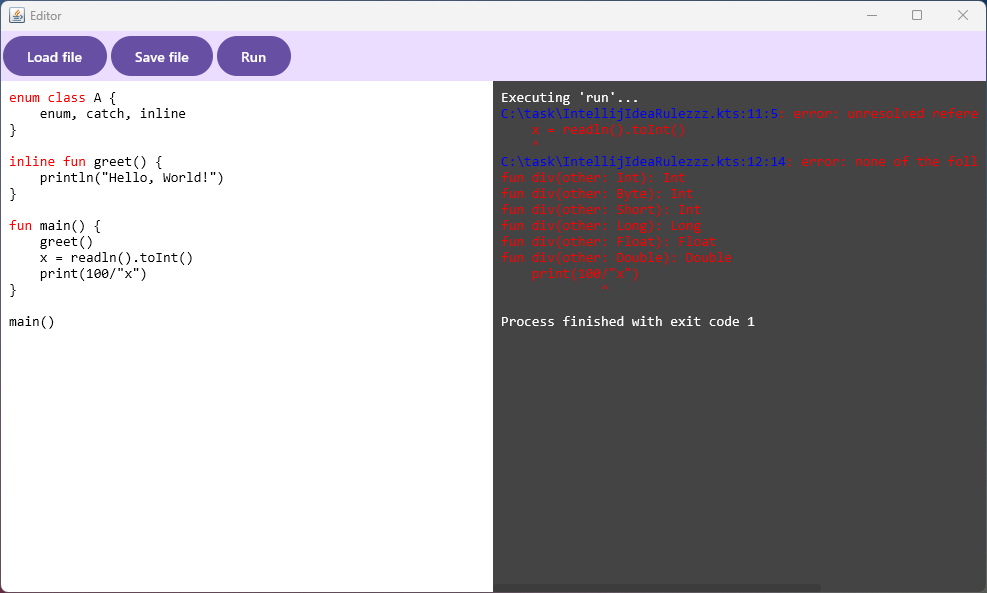
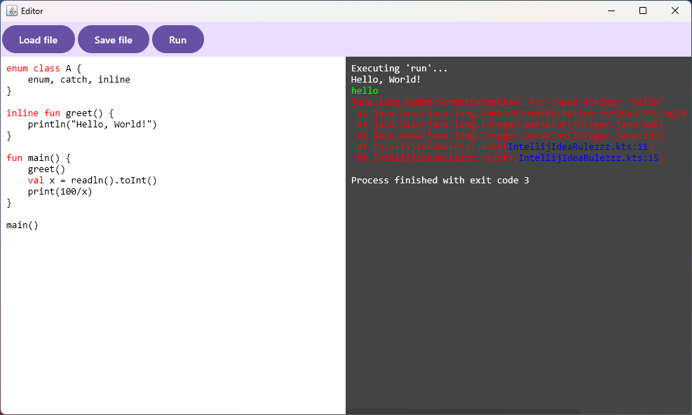
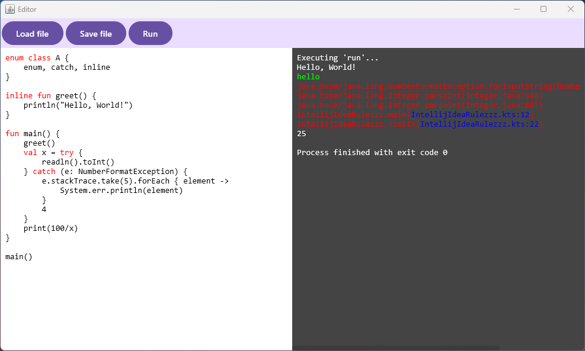

This is an Editor project built for a JetBrains internship application.

### Features

Editor pane highlights hard keywords always and soft keywords where appropriate.
New highlights are easily added by overriding appropriate methods inside the 
[Annotator](composeApp/src/jvmMain/kotlin/com/zeks/jetbrains/task/editor/Annotator.kt).

Console features color coding for standard and error output and user input. Error messages that include
paths of the currently opened file are clickable and will focus the editor pane on the corresponding line.

When a process is finished or forcefully stopped, the console will show the exit code of the process.

### Video example

[](https://youtu.be/xZzzm27vA24)


### Screenshots

Hard and soft keywords highlighting and compiler errors:


User input and runtime error:


Successful exit code:


### Build and Run on Windows

To build and run the development version on Windows, use the run configuration from the run widget
in your IDE’s toolbar or run it directly from the terminal:

  ```shell
  .\gradlew run
  ```

### Notes

This projects uses antlr and Kotlin grammar taken from:
https://github.com/Kotlin/kotlin-spec/tree/release